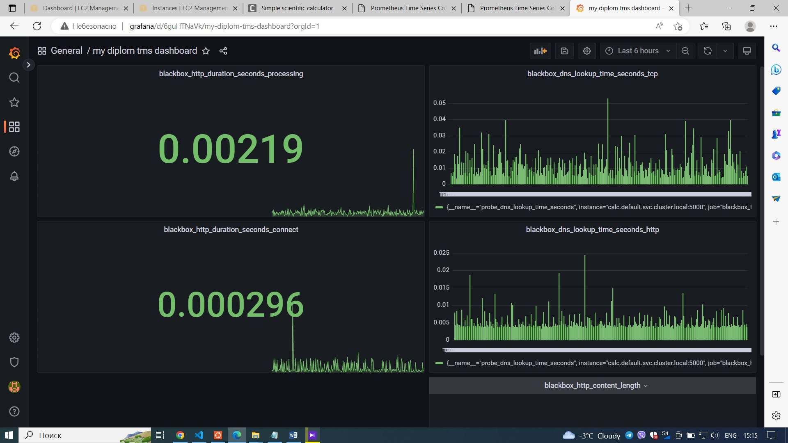

# Развертывание мониторинга приложения и инфраструктуры проекта

Если Вы хотите мониторить приложение и инфраструктуру проекта необходимо развернуть Prometheus и Grafana.
Для снятия метрик с приложения используется blackbox exporter, а также реализовано автоматическое добавление источника данных и созданного дашборда в Grafana.

## Требования

- Helm version v3.11.1 или новее
- добавить в Helm репозитории Grafana `helm --kube-insecure-skip-tls-verify repo add grafana` и prometheus-community `helm --kube-insecure-skip-tls-verify repo add prometheus-community https://prometheus-community.github.io/Helm-charts`

## Как использовать

- Если Вы хотите использовать custom dashboard в Grafana по умолчанию: 

то перед запуском скрипта на установку Prometheus и Grafana, необходимо выполнить команду извлечения всех зависимостей диаграмм `helm --kube-insecure-skip-tls-verify dependency build` , а после команду на обновление `helm --kube-insecure-skip-tls-verify repo update`

- Если Вы хотите использовать собственный custom dashboard в Grafana:
  - в директории панелей мониторинга grafana `cd helm-charts/charts/kube-prometheus-stack/templates/grafana/dashboards-1.14/`, которая содержит все готовые панели мониторинга добавте свою панель инструментов `my-dashboard.yaml` по средством создания ConfigMap helm
  - выполните команду извлечения всех зависимостей диаграмм `helm --kube-insecure-skip-tls-verify dependency build`
  - выполните команду на обновление `helm --kube-insecure-skip-tls-verify repo update`
  - запуск команды шаблона helm, для отображения манифестов yaml сохранение в файл для проверки добавления Вашего манифеста ConfigMap `helm --kube-insecure-skip-tls-verify template kube-prometheus-stack . --validate > rendered-template.yaml`
  - проверка файла `rendered-template.yaml` , чтобы убедиться, что наш ConfigMap создан и будет применяться при запуске команды установки helm на следующем шаге

- После проведения вышеуказанных действий, Вы можете перейти к созданию объектов в кластере и развертыванию Prometheus и Grafana

## Установка
Запустить скрипт install_prometheus.sh

## Удаление
Запустить скрипт uninstall_prometheus.sh

## Обзор

Cкрипт на установку создаст, а на удаление удалит:

- NAMESPASE `monitoring` в Вашем K8s кластере
- Объекты `deployment` и `service` blackbox exporter в созданном namespace
- Запустит  `helm chart` на создание/удаление объектов для Prometheus и Grafana с custom dashboard
